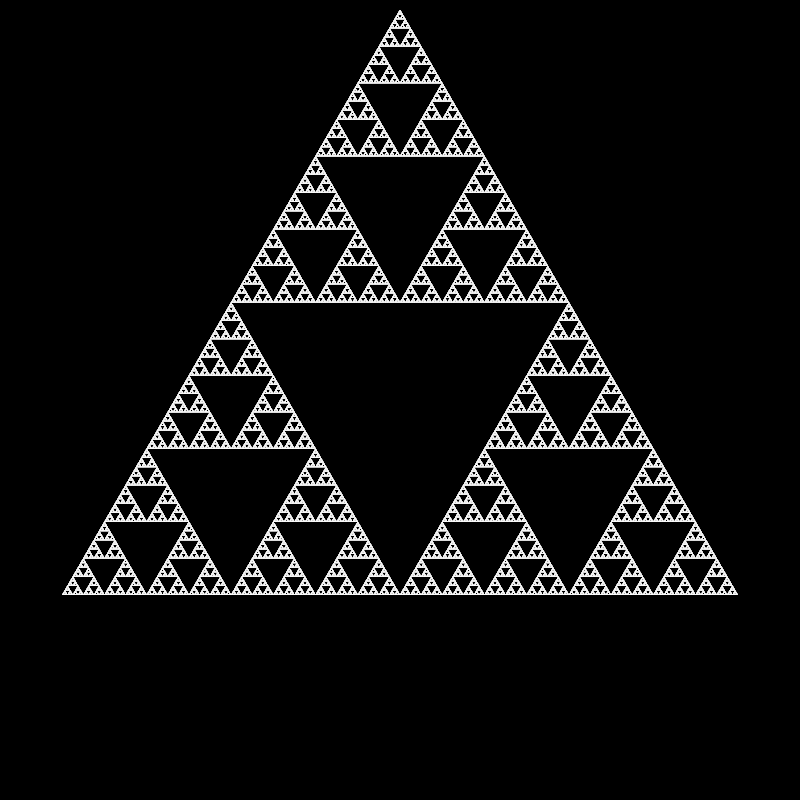
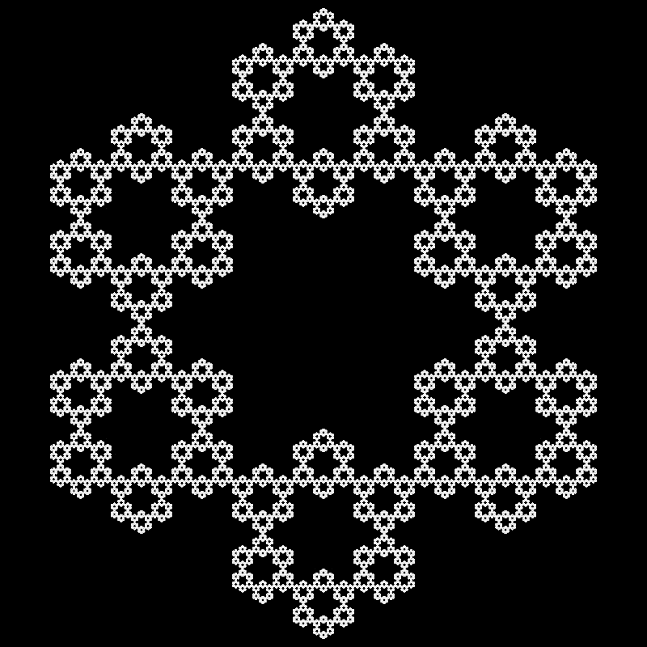
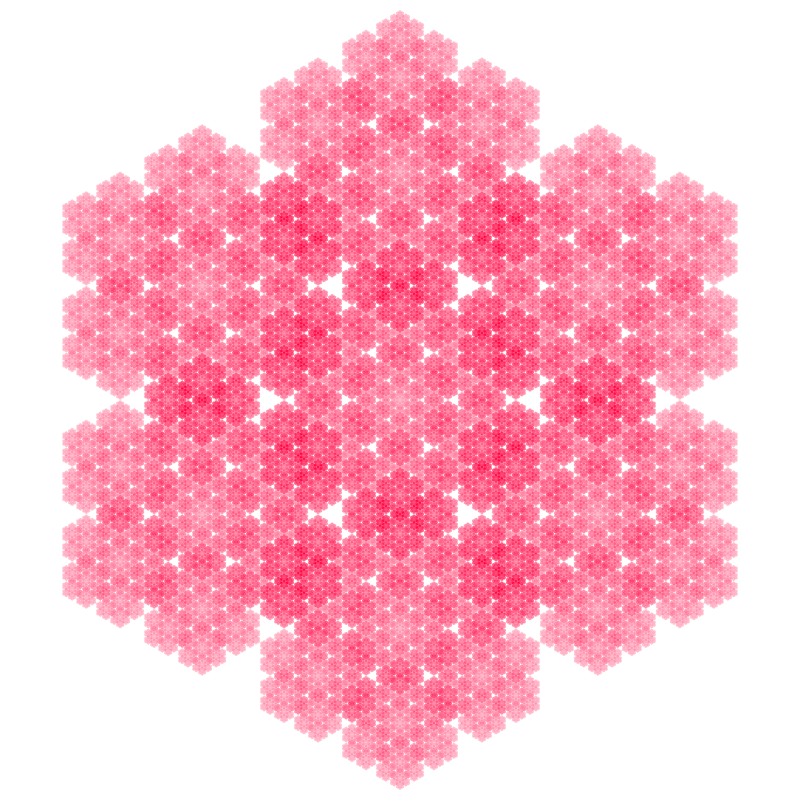
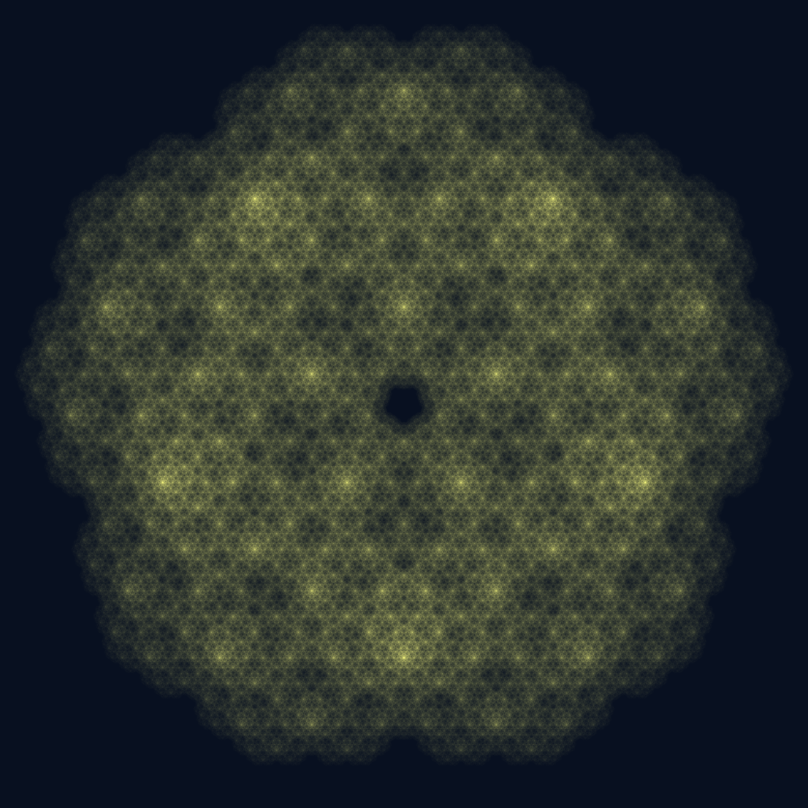
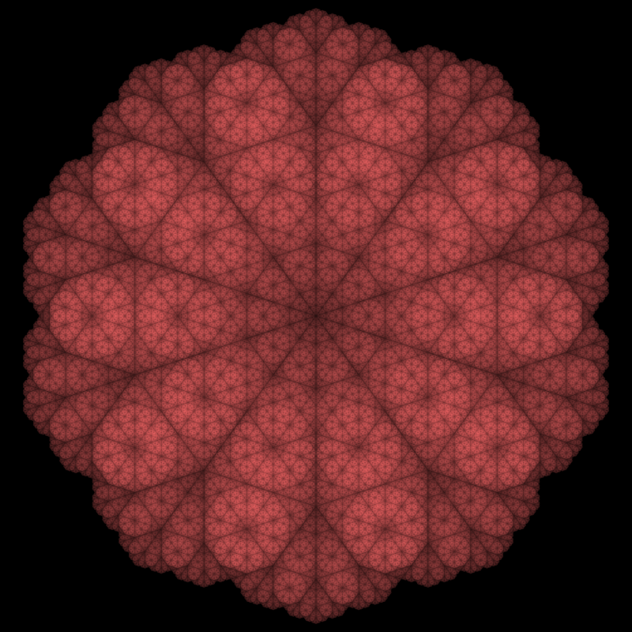

# Chaos Game

[](https://opensource.org/licenses/MIT)


A high-performance, highly configurable fractal generator based on the Chaos Game algorithm, using a
**Web Worker** and an **OffscreenCanvas** to ensure a smooth, non-blocking user experience, even with millions of
points.

## Gallery

Here are a few examples of fractals generated with this tool, showcasing different settings.

<table align="center">
    <thead>
    <tr>
        <th>Title</th>
        <th>Settings</th>
        <th>Image</th>
    </tr>
    </thead>
    <tbody>
    <tr>
        <td>Sierpinski triangle</td>
        <td><code>sides: 3</code><br><code>jumpDistance: 0.5</code><br><code>restriction: 'none'</code></td>
        <td width="300px">


        </td>
    </tr>
    <tr>
        <td>Sierpinski Hexagon</td>
        <td><code>sides: 6</code><br><code>jumpDistance: 0.6667</code><br><code>restriction: 'none'</code></td>
        <td width="300px">


        </td>
    </tr>
    <tr>
        <td><i>The Hexagonal Bloom</i></td>
        <td><code>sides: 6</code><br><code>jumpDistance: 0.585786</code><br><code>restriction: 'none'</code><br>
        <code>centerVertex: true</code><br><code>solidBg: false</code><br><code>fgColor: "#FF0040"</code><br>
        <code>gammaExponent: 5</code></td>
        <td width="300px">


        </td>
    </tr>
    <tr>
        <td>Unnamed</td>
        <td><code>sides: 5</code><br><code>jumpDistance: 1.618034</code><br><code>restriction: 'no-repeat'</code>
        <br><code>fgColor: "#FFFF80"</code><br><code>bgColor: "#081020"</code><br><code>gammaExponent: 4</code><br>
        <code>canvasSize: 1000</code><br><code>padding: 380</code></td>
        <td width="300px">


        </td>
    </tr>
    <tr>
        <td>Unnamed</td>
        <td><code>sides: 10</code><br><code>jumpDistance: 0.618034</code><br><code>restriction: 'none'</code><br>
        <code>fgColor: "#E05C5C"</code></td>
        <td width="300px">
        

        </td>
    </tr>
    </tbody>
</table>

## What is the Chaos Game?

The [Chaos Game](https://en.wikipedia.org/wiki/Chaos_game) is a simple algorithm for generating fractals.
It works like this:

1. Define a set of points (e.g., the vertices of a polygon).
2. Start with a random point anywhere inside the polygon.
3. Randomly Choose one of the polygon's vertices.
4. Move a fraction of the distance (e.g., halfway) from your current point toward the chosen vertex.
5. Plot a point at this new location.
6. Repeat from step 3, using the newly plotted point as the current point.

By repeating this process thousands or millions of times, self-similar fractal patterns emerge from the
chaos.

## Features

- **Non-Blocking Simulation:** All calculations run in a separate Web Worker, so the main UI thread remains responsive.
- **Extensive Customization:** Control the number of sides, jump distance, colors, extra vertices, and more.
- **Advanced Restriction Rules:** Go beyond the basic algorithm by applying rules that forbid choosing certain vertices,
  such as:
    - `no-repeat`: Cannot pick the same vertex twice in a row.
    - `no-neighbor`: Cannot pick a vertex adjacent to the last one.
    - ...and more!
- **Symmetry Mode:** Instantly create perfectly symmetrical fractals by applying rotational and reflectional symmetry to
  every plotted point.
- **Smart Simulation Control:** Features like live rendering, auto-stop when the fractal is complete, and easy PNG
  download.

## Getting Started

You can use Chaos Game JS either by installing it as an NPM package or by including it directly in your HTML file from a CDN.

### Option 1: Usage with a Module Bundler (Vite, Webpack, etc.)

1.  **Installation**
    ```bash
    npm install chaos-game
    ```

2.  **HTML Setup**
    Create an `index.html` file with a canvas element. Make sure your `worker.js` file is accessible from your project's public directory.

    ```html
    <!DOCTYPE html>
    <html lang="en">
    <body>
      <canvas id="chaos-canvas" width="800" height="800"></canvas>
      <script type="module" src="main.js"></script>
    </body>
    </html>
    ```

3.  **JavaScript Usage**
    In your `main.js` file, import the `ChaosGame` class, define your settings, and start the simulation.

    ```javascript
    import { ChaosGame } from 'chaos-game';

    const canvas = document.getElementById('chaos-canvas');

    const settings = {
      canvasSize: 800,
      sides: 5,
      jumpDistance: 0.6,
      restriction: 'no-repeat',
      symmetrical: true,
      // ... other settings
    };

    const game = new ChaosGame(canvas, settings);
    game.play();
    ```

### Option 2: Usage in the Browser via CDN

1.  **HTML Setup**
    Simply add the script tag to your `index.html`. The `ChaosGame` class will be available globally.

    ```html
    <!DOCTYPE html>
    <html lang="en">
    <body>
      <canvas id="chaos-canvas" width="800" height="800"></canvas>

      <!-- 1. Load the library from the CDN -->
      <script src="https://cdn.jsdelivr.net/npm/chaos-game@1.0.4"></script>

      <!-- 2. Your script to run the game -->
      <script>
        const canvas = document.getElementById('chaos-canvas');

        const settings = {
          canvasSize: 800,
          sides: 5,
          jumpDistance: 0.6,
          restriction: 'no-repeat',
          symmetrical: true,
          // ... other settings
        };

        // Note: The worker.js is loaded automatically by the library
        const game = new ChaosGame(canvas, settings);
        game.play();
      </script>
    </body>
    </html>
    ```

### Configuration (`ChaosGameSettings`)

You can pass any of these options in the `settings` object during instantiation or update them later with
`updateSetting(key, value)`.

| Option                        | Type      | Default   | Description                                                               |
|-------------------------------|-----------|-----------|---------------------------------------------------------------------------|
| `canvasSize`                  | `number`  | 1000      | Width and height of the canvas in pixels.                                 |
| `sides`                       | `number`  | 3         | Number of vertices in the main polygon.                                   |
| `jumpDistance`                | `number`  | 0.5       | Fraction of the distance to move towards the chosen vertex.               |
| `padding`                     | `number`  | 10        | Margin in pixels from the canvas edge to the polygon.                     |
| `midpointVertex`              | `boolean` | false     | If true, adds vertices at the midpoint of each side.                      |
| `centerVertex`                | `boolean` | false     | If true, adds a vertex at the center of the polygon.                      |
| `restriction`                 | `string`  | 'none'    | The rule for choosing the next vertex (e.g., `'none'`, `'no-repeat'`).    |
| `fgColor`                     | `string`  | '#FFFFFF' | The foreground color for points and outlines (CSS format).                |
| `bgColor`                     | `string`  | '#000000' | The background color (CSS format).                                        |
| `solidBg`                     | `boolean` | true      | If true, use a solid background; otherwise, it's transparent.             |
| `gammaExponent`               | `number`  | 3         | Gamma correction value for adjusting brightness and contrast.             |
| `drawCircle`                  | `boolean` | false     | If true, draws the circumscribing circle.                                 |
| `drawPolygon`                 | `boolean` | false     | If true, draws the main polygon's outline.                                |
| `symmetrical`                 | `boolean` | true      | If true, applies rotational and reflectional symmetry.                    |
| `autoStop`                    | `boolean` | true      | If true, the simulation stops automatically when stable.                  |
| `liveRendering`               | `boolean` | true      | If true, the canvas updates periodically during the simulation.           |
| `stabilityNewPixelsThreshold` | `number`  | 1         | Threshold for new pixels below which the simulation is considered stable. |

### Methods

- `.play()`: Starts or resumes the simulation.
- `.stop()`: Pauses the simulation.
- `.reset()`: Clears the canvas and restarts the simulation with the current settings.
- `.updateSetting(key, value)`: Updates a single setting.
- `.download()`: Triggers a download of the current canvas as a PNG file.
- `.on(eventName, callback)`: Listens for events like `'finish'` or `'stabilityCheck'`.

## License

This project is licensed under the MIT License. See the [LICENSE](LICENSE) file for details.

---
Created by [Mohammad Sarabi](https://github.com/m-sarabi).
